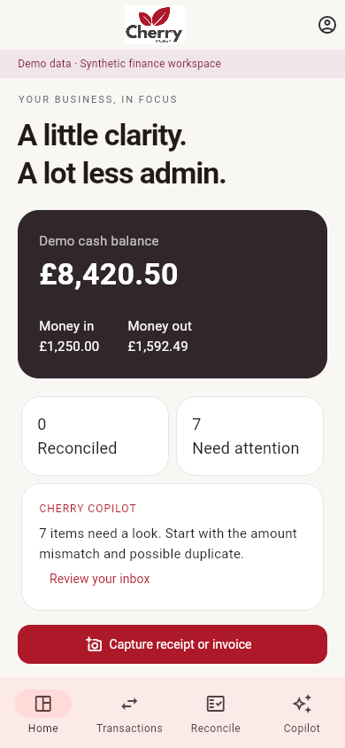
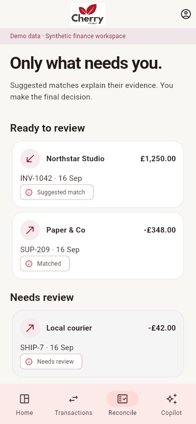
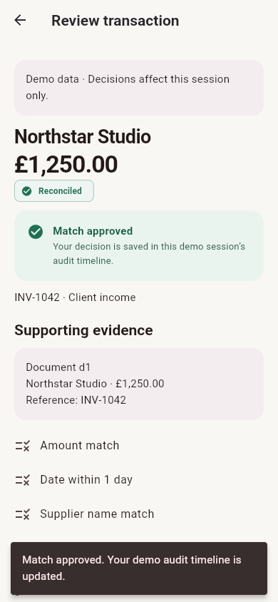
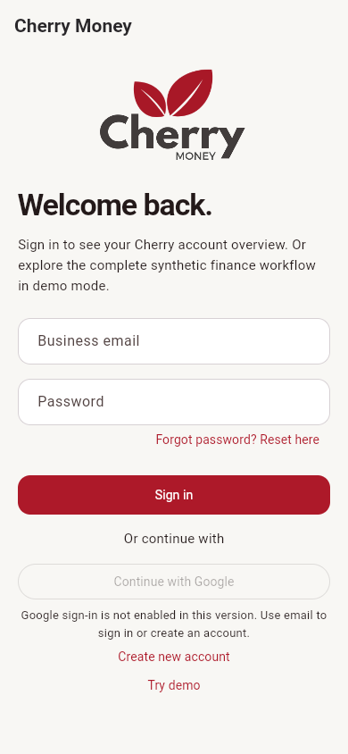
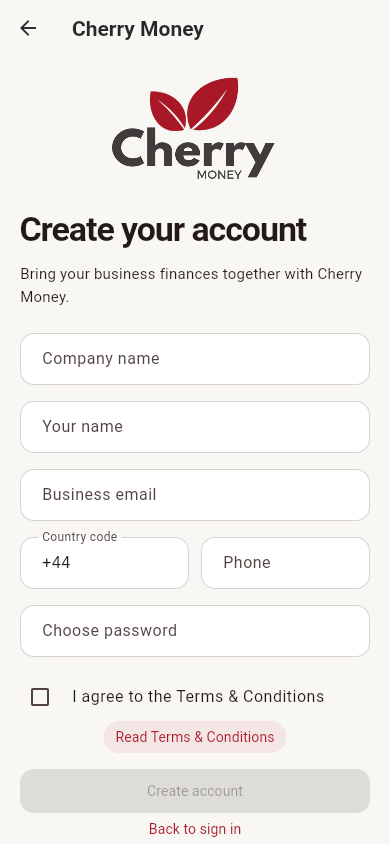
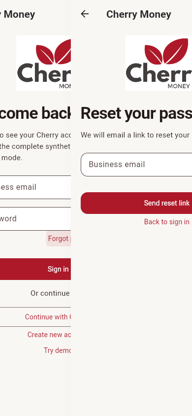
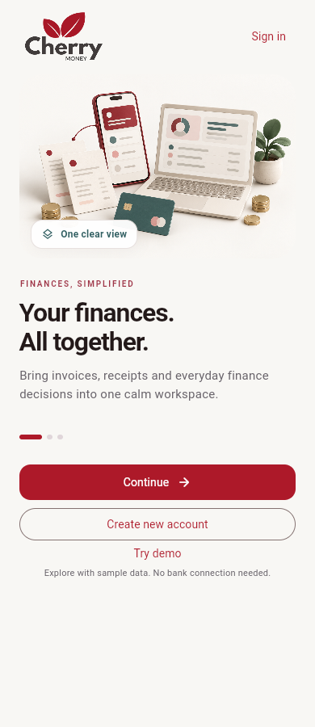
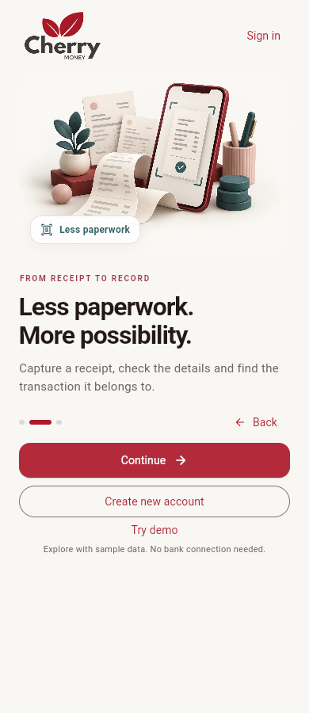
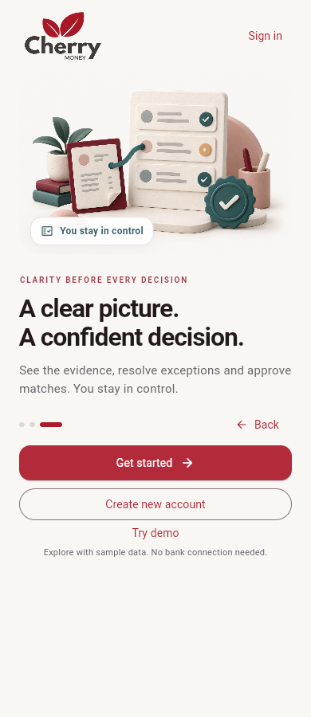

# Cherry Money Mobile

A Flutter finance workspace for small businesses: capture → understand → match → review exceptions → approve. A Flutter rebuild of the existing Cherry mobile product, with RevenueCat integration for a Shipaton prototype. This repository contains Flutter code only.

**Status: uploaded to App Store Connect, not submitted for review or released.** Apple accepted iOS version 5.1.0 (build 501) for processing on 19 September 2026. The RevenueCat Test Store catalog remains available for development, and the production Apple app connection is configured. Production subscription products, pricing, offerings, and signed sandbox purchase/restore testing are still required before subscriptions can be sold. Prior mobile release eligibility has not been confirmed. Renaming/rebuilding an existing released app does not establish Shipaton eligibility.

## Run

Development toolchain: Flutter **3.41.9 stable**, bundled Dart **3.11.5**. Use Flutter's bundled `dart` (the machine's standalone Dart is 3.11.4).

```sh
flutter pub get
flutter run --dart-define=CHERRY_ENV=development
```

Select **Try demo**. Synthetic data is labelled throughout. Camera/gallery/file selection previews files locally; demo extraction returns an explicitly labelled sample, not OCR results from the selected file. Web is a convenient demo preview only, not an eligible Shipaton submission platform.

```sh
flutter run \
  --dart-define=CHERRY_ENV=development \
  --dart-define=CHERRY_API_BASE_URL=https://dev.cherrymoney.co.uk/api/ \
  --dart-define=REVENUECAT_IOS_API_KEY=YOUR_PUBLIC_IOS_SDK_KEY \
  --dart-define=REVENUECAT_ANDROID_API_KEY=YOUR_PUBLIC_ANDROID_SDK_KEY
```

Production defaults to `https://cherrymoney.co.uk/api/` when `CHERRY_ENV=production`. Keys are passed during builds; no `.env` loader is used. Do not place secret server API keys in a mobile build.

The existing RevenueCat Test Store project is ready for native development builds:

```sh
flutter run --dart-define-from-file=config/revenuecat-test.json
```

Its public Test Store SDK key is safe to include in a client build and cannot call RevenueCat's secret APIs. The app refuses a `test_` key in Production. Web builds keep purchases unavailable because RevenueCat purchases run in the native iOS or Android app.

## Integration boundary

The native finance expansion uses the Production mobile API deployed in revision `ca-cm-prod-uks--0000013`. See [feature coverage and rollout](docs/LIVE_FINANCE.md). Web fallback modules are clearly labelled; they are not native feature parity.


| Capability | Implementation |
| --- | --- |
| Account creation | Company/name/email/country code/phone/password, required Terms acceptance, email verification and resend |
| Password recovery | Reset-link email through the existing Cherry API |
| Cherry sign-in, overview, logout | Production email/Google authentication and live overview |
| Google sign-in | Browser sign-in enabled; Production token-verification hotfix deployed |
| Token storage | OS secure storage through flutter_secure_storage |
| Banking and reconciliation | Native bank connection entry, in-app provider approval, company-scoped accounts/activity, match suggestions, staged proposals and explicit approval |
| Ask Cherry | Live questions with bounded conversation history; guided invoice, quote, expense, supplier-bill, VAT-preview and payment-draft actions |
| Invoices, quotes, expenses | Live paginated lists, details and creation; invoice PDF links |
| Clients, products, payments, recurring invoices | Live lists; advanced management opens the existing website |
| More features | VAT/HMRC, reports, budgets, ledger, credit notes, Cherry Pay and administration open the website with its own login |
| Camera and file selection | Live scans upload only on explicit selection; demo files remain local; hardware verification pending |
| Receipt OCR | JPEG/PNG upload → server extraction → editable review → confirmed expense save with receipt attachment through the deployed mobile API |
| RevenueCat | Existing `default` Test Store offering plus a production Apple app connection; purchase, restore and `cherrymoney_pro` entitlement refresh use the real SDK |
| Limits | Free 3 / Pro 100 capture or approval actions per calendar month on this device |
| Pro capability | Detailed demo cashflow insight and expanded demo action allowance |
| Business | Planned tier; no RevenueCat product is sold by this build |

Subscriptions use RevenueCat's anonymous installation identity and store account. They do not modify an existing Cherry company web plan. Usage counters are prototype limits, not secure cross-device billing enforcement. Demo decisions reset on a new demo session; monthly usage persists.

## RevenueCat setup

RevenueCat project `2a6f083f` contains Test Store app `app1eeb63a621`, the `cherrymoney_pro` entitlement, and monthly, yearly and lifetime packages in the current `default` offering. Use the checked-in public Test Store build profile for development. The production Apple app uses bundle ID `com.cherryInvoiceNewApp.app`; Android uses `uk.co.cherrymoney.mobile`. Connect each store's products to the entitlement and `default` offering, then supply the appropriate public SDK key through Dart defines. Exercise purchase/cancel/pending/restore/expiry on signed native sandbox builds. The app never pretends a purchase succeeded.

Before sale, review the limited demo-only value, publish privacy/subscription terms, implement production usage enforcement and account identity handling, and configure the commercial offering appropriately. See [security limitations](docs/SECURITY.md).

## Verify and build

```sh
dart format --set-exit-if-changed lib test integration_test
flutter analyze
flutter test
flutter build apk --debug
flutter build ios --simulator
# Clean device/session required for this test's starter allowance:
flutter test integration_test/demo_flow_test.dart -d DEVICE_ID
```

[Validation results](docs/VALIDATION.md) distinguish executed checks from unverified native/external integrations. CI runs formatting, analysis, tests and Android build without keys.

For signed Android bundles, upload-key handling, Play Console setup, Play App Signing Google OAuth and the RevenueCat production handoff, follow the [Google Play release guide](docs/GOOGLE_PLAY_RELEASE.md).

## Store download size

The production Android App Bundle is optimized for Play delivery. The original 1536 × 1024 onboarding artwork remains in the repository as source material, while the app bundles 960 × 640 WebP variants (81 KB combined instead of 5.34 MB). A local Bundletool 1.18.3 estimate on 17 September 2026 measured a **10.5–11.2 MB compressed Play download**, depending on the device. The 47.8 MB `.aab` upload contains every supported architecture and is not the size downloaded by one device.

The signed iOS 5.1.0 (501) IPA uploaded to App Store Connect is 33.4 MB. That is an upload artifact rather than the device download size; Apple’s thinned, compressed size report is still required before claiming the App Store download is below 20 MB.

## Screenshots

Actual running Flutter web preview at a 390 × 844 phone viewport:

| Dashboard | Review inbox | Approved match |
| --- | --- | --- |
|  |  |  |

Browser smoke check: onboarding → demo dashboard → review inbox → Northstar transaction → approve → reconciled status and audit event. No page errors observed. Native store/paywall screenshots still require a configured device build.

## Development workflow

Use `feat/<description>` for feature development and `fix/<description>` for bug fixes. Keep `main` as the baseline; open a pull request for changes. Git author identity for this repository is `sohamtechuk`.

## Google sign-in setup

Deploy the [backend token-verification fix](https://github.com/sohamtech-uk/cherrymoney/pull/186) and migration before enabling mobile Google sign-in. Configure Google OAuth Android credentials for `uk.co.cherrymoney.mobile` and its signing certificate, and an iOS client for that bundle ID. Add the iOS client's reversed client-ID URL scheme to `ios/Runner/Info.plist` using your actual Google configuration. Follow the [Flutter Google sign-in setup](https://pub.dev/packages/google_sign_in).

The supplied public Web OAuth client ID is configured by default. After backend deployment and OAuth origin setup, build with `CHERRY_GOOGLE_AUTH_ENABLED=true` and, for iOS, `GOOGLE_IOS_CLIENT_ID=<ios-client-id>`. `GOOGLE_SERVER_CLIENT_ID` remains available as an environment override. The backend `GOOGLE_MOBILE_SERVER_CLIENT_ID` must match the mobile server client ID. Unconfigured builds show a disabled Google button and explain the available email alternative before any click. The browser uses the Google Identity Services button and authentication events; native apps use the platform SDK. Both send only the signed ID token to Cherry for verification. See [browser and native activation steps](docs/GOOGLE_SIGN_IN.md).

For the explicitly selected Production browser preview, build with `flutter build web --dart-define-from-file=config/preview-production.json`. This uses live Cherry accounts and enables the Google button. It does not deploy or configure the Production backend; see [current connection status](docs/AUTH_CONNECTIVITY.md).

The Terms link opens the configured Cherry website's `/term` page. Acceptance is required locally and sent as `terms_accepted`; the existing signup endpoint does not persist a versioned consent record.

## Provenance

This is a new Flutter repository for an existing Cherry product. The supplied ZIP identifies source revision `41a45e79ed1b1627749a5500b6965d6ff48b3372`. Its Angular/Ionic implementation is not included in the published branch history. The original archive and upstream mobile repository remain unchanged, and a local Git bundle preserves the history before cleanup.

The Flutter-only root commit is named **First commit**, authored by **sohamtechuk**, with its actual creation date. This is a repository-history cleanup, not evidence that the product or its existing authentication features were first created during Shipaton. Event eligibility still needs confirmation.

See [architecture](docs/ARCHITECTURE.md), [API migration](docs/API_MIGRATION.md), [migration provenance](docs/LEGACY_MIGRATION.md), [security](docs/SECURITY.md), and [Shipaton checklist](docs/SHIPATON.md).

## Authentication screens

| Sign in | Create account | Reset password |
| --- | --- | --- |
|  |  |  |

## Interface and motion

The interface includes a clearer cash overview, review progress, gentle page entrances, animated onboarding, loading feedback and approval confirmations. Custom motion respects reduced-motion preferences; financial amounts remain stable. See [experience design](docs/EXPERIENCE.md).

## Illustrated welcome

Three original finance scenes introduce the workspace, receipt capture and review workflow. The artwork is bundled locally and transitions gently, with reduced-motion support.

| Finances together | Capture paperwork | Review with confidence |
| --- | --- | --- |
|  |  |  |

[Artwork prompts and asset provenance](docs/ONBOARDING_ARTWORK.md).
